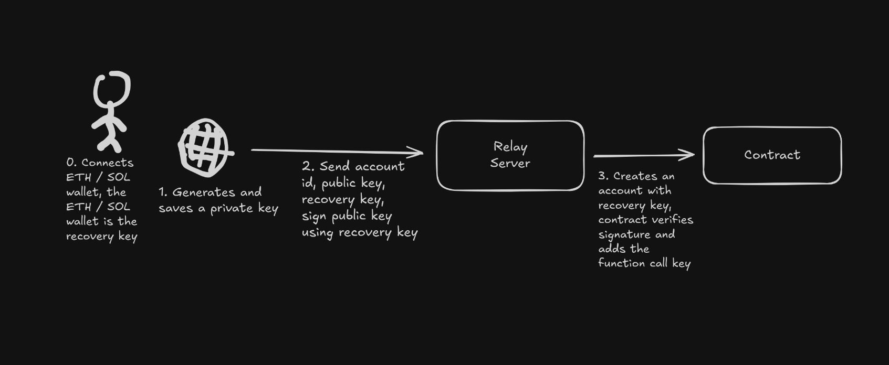

# Recoverable Accounts

This project allows users to create a recoverable account on NEAR using a third-party recovery key, which is needed for recovery, but not needed to sign transactions.

## How it works

